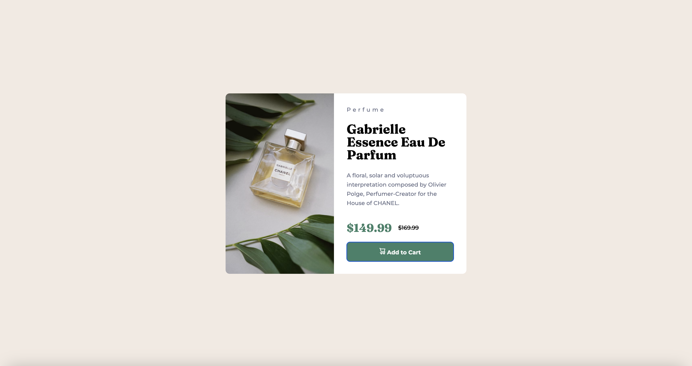

# 🚀 Frontend Mentor - Product Preview Card Component Solution 🚀

This is a solution to the [Product Preview Card Component Challenge on Frontend Mentor](https://www.frontendmentor.io/challenges/product-preview-card-component-GO7UmttRfa). Frontend Mentor challenges help you improve your coding skills by building realistic projects. 🎯



## 📚 Table of Contents 📚

- [Overview](#overview)
  - [The Challenge](#the-challenge)
  - [Screenshot](#screenshot)
  - [Links](#links)
- [My Process](#my-process)
  - [Built With](#built-with)
  - [What I Learned](#what-i-learned)
- [Author](#author)

## 🌐 Overview 🌐

This project is a solution to the Product Preview Card Component Challenge on Frontend Mentor. The main goal of the challenge was to build a product preview card component and make it look as close to the provided design as possible. The card is designed to be responsive, adjusting its layout depending on the user's device screen size. 

The card includes interactive elements, such as buttons, which have hover and focus states for enhanced user experience. The project was built using semantic HTML5 markup, CSS custom properties, Flexbox, and a mobile-first workflow. 

The project provided an opportunity to practice and improve coding skills, particularly in creating responsive designs and interactive elements. The code for the product card can be found in the @index.html and @style.css files.

### 🎯 The Challenge 🎯

The challenge was to build a product preview card component and get it looking as close to the design as possible. The users should be able to:

- View the optimal layout depending on their device's screen size
- See hover and focus states for interactive elements

### 📸 Screenshot 📸

Desktop Version:


Mobile Version:


### 🔗 Links 🔗

- Live Site URL: [Add live site URL here](https://tuminha.github.io/Product-Preview-Card-Component/)
- Solution URL: [Add solution URL here](https://www.frontendmentor.io/solutions/product-preview-card-component-I15Z6NUDmM)

## 🛠 My Process 🛠

### Built With 🧰

- Semantic HTML5 markup
- CSS custom properties
- Flexbox
- Mobile-first workflow

### 🎓 What I Learned 🎓

During this project, I learned how to create a responsive product card using HTML and CSS. I practiced using flexbox for layout and CSS custom properties for styling. I also learned how to create a hover effect for buttons. Check out the @index.html and @style.css files for more details.

Here's a snippet of the CSS code I used for the product card:

```css
css
.product-box {
max-width: 600px;
width: 100%;
height: 450px;
border-radius: 10px;
display: inline-flex;
flex-wrap: nowrap;
justify-content: center;
align-items: center;
position: relative;
box-sizing: border-box;
overflow: hidden;
}
```

## 👨‍💻 Author 👨‍💻

- Frontend Mentor - [@Tuminha](https://www.frontendmentor.io/profile/Tuminha)
- Twitter - [@cisco_research](https://www.twitter.com/cisco_research)

